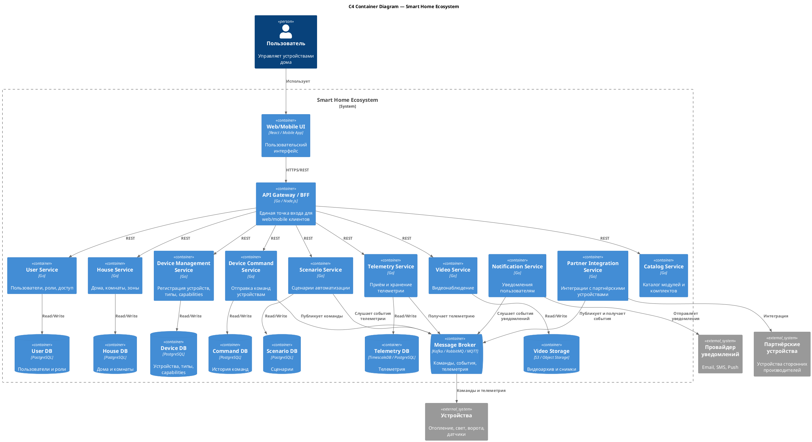
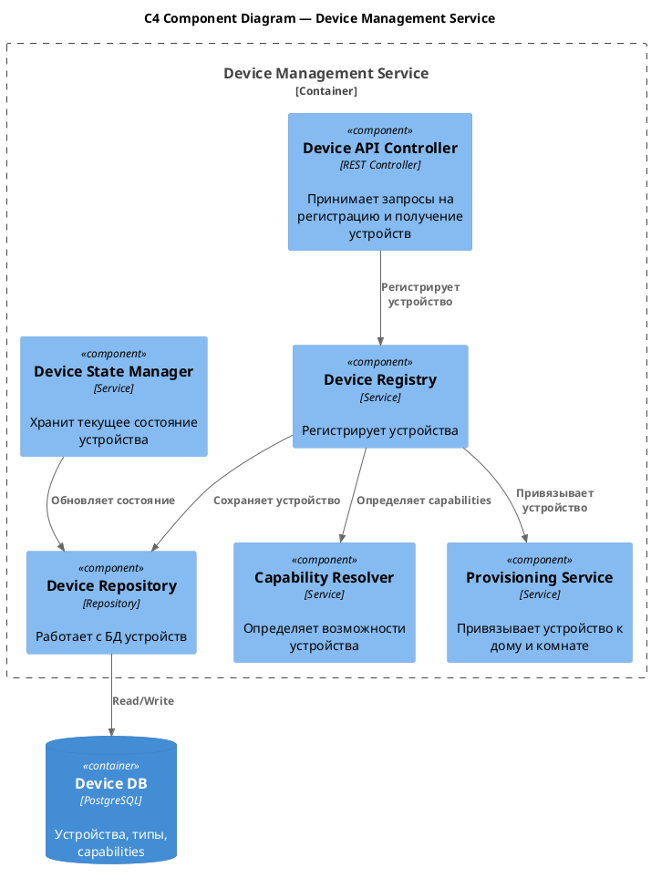
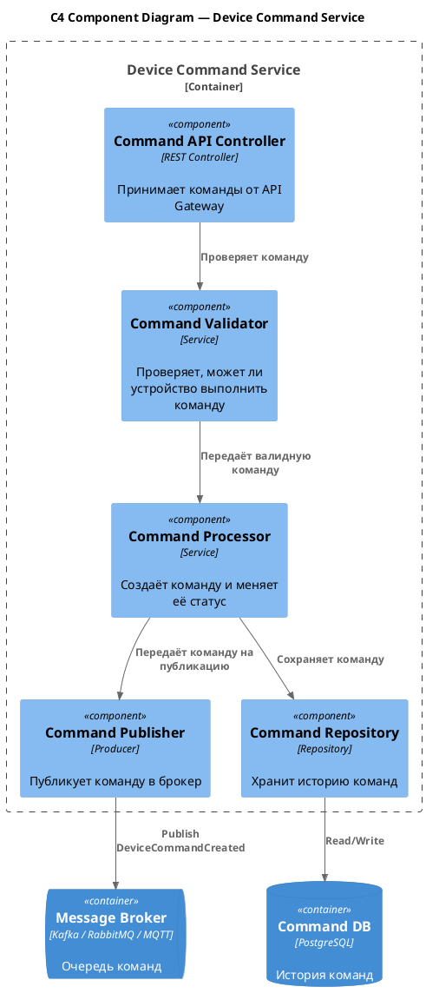
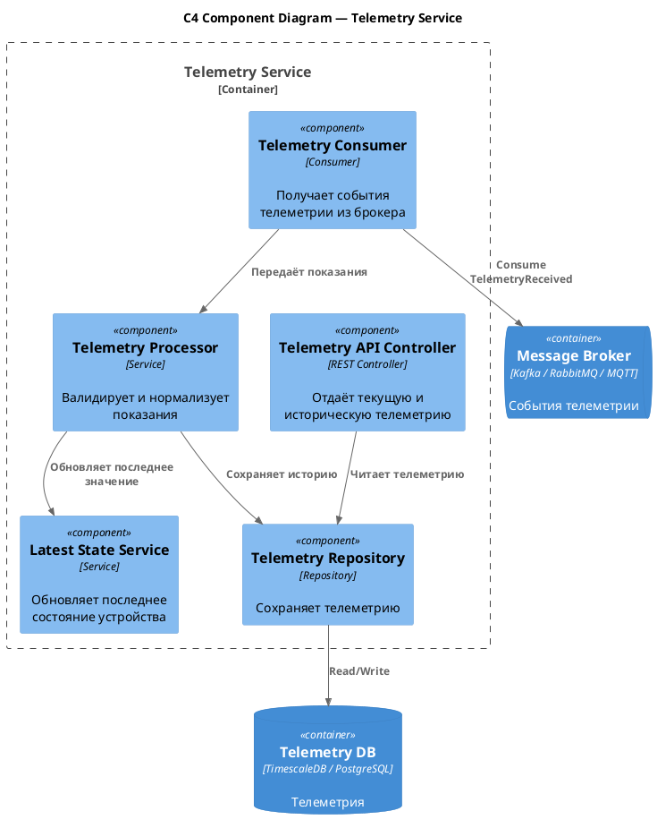
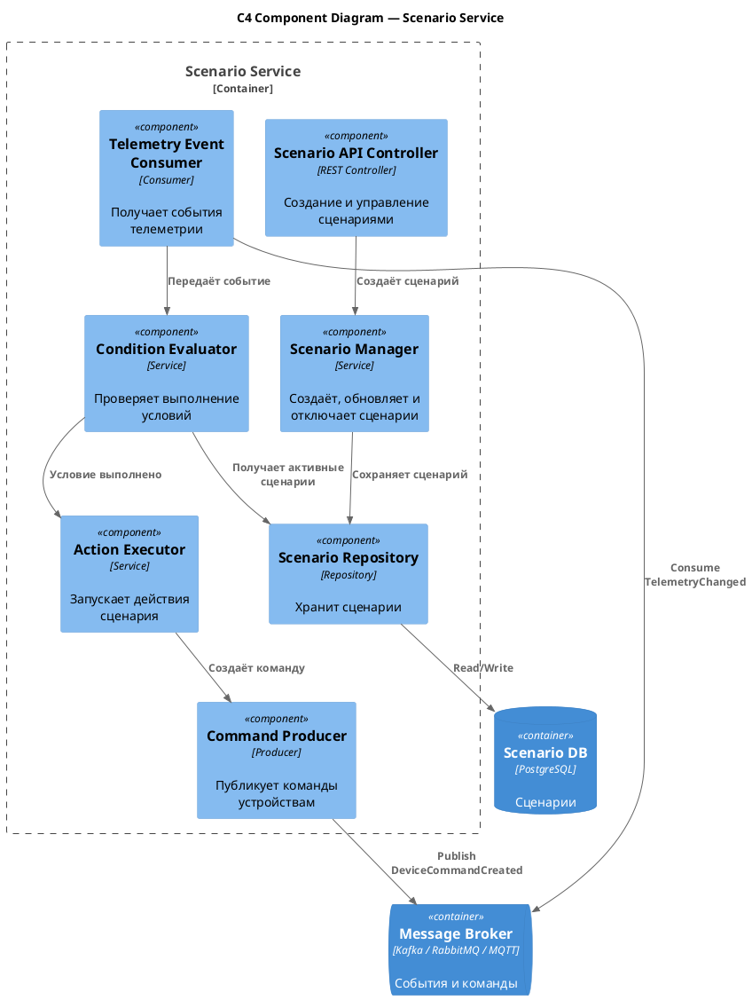
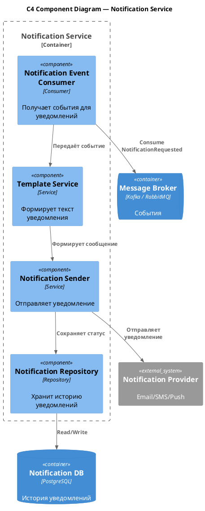
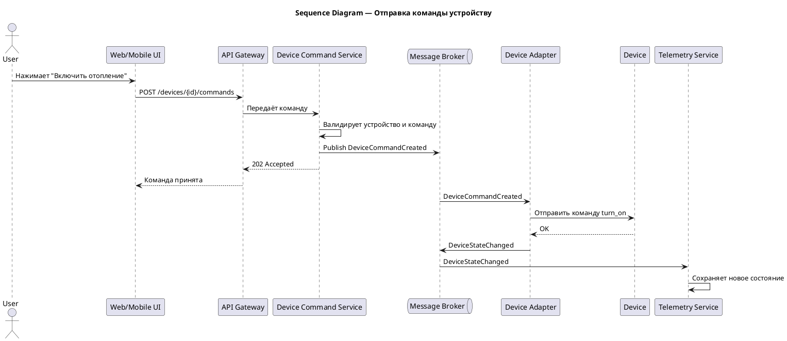
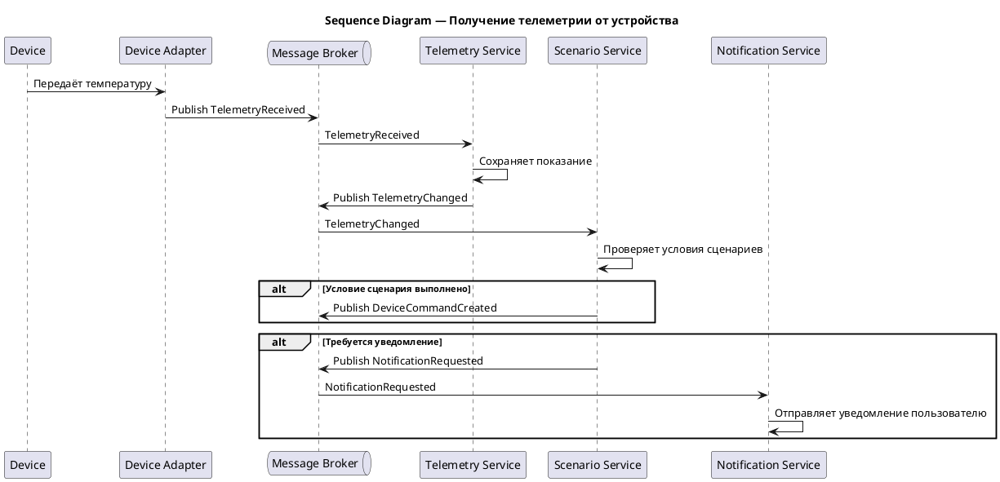
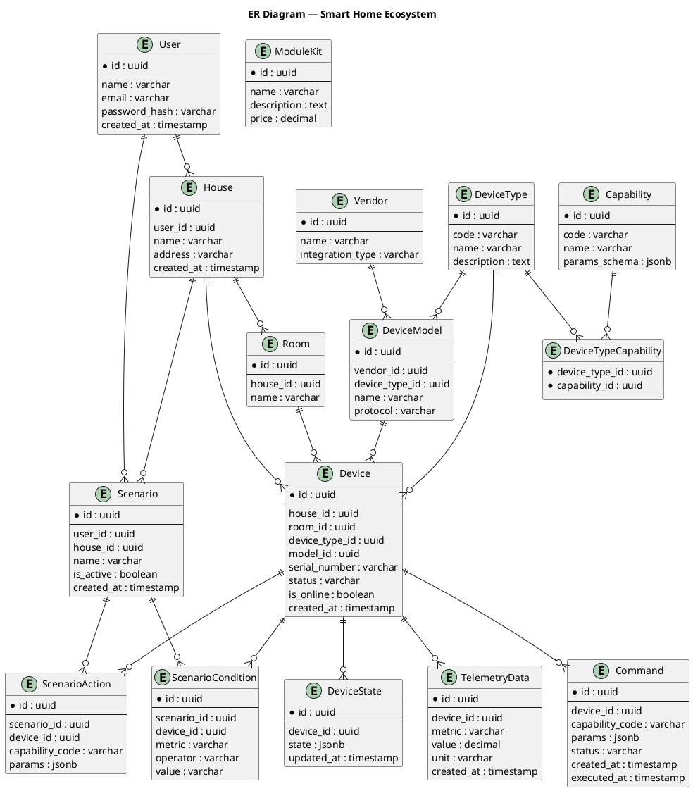

# Project_template

Это шаблон для решения проектной работы. Структура этого файла повторяет структуру заданий. Заполняйте его по мере работы над решением.

# Задание 1. Анализ и планирование

<aside>

Чтобы составить документ с описанием текущей архитектуры приложения, можно часть информации взять из описания компании и условия задания. Это нормально.

</aside>

## 1. Описание функциональности монолитного приложения

### Управление отоплением

* Пользователи могут включать и выключать отопление в доме через веб-интерфейс.
* Система поддерживает только базовое управление отоплением: включение и отключение.
* Управление отоплением реализовано внутри монолитного приложения.
* Пользовательский запрос обрабатывается синхронно: сервер получает команду от пользователя и отправляет её в сторону устройства.
* Всё управление идёт от сервера к датчику.
* Сейчас система ориентирована только на отопление.

### Мониторинг температуры

* Пользователи могут смотреть текущую температуру в помещениях.
* Система получает данные с температурных датчиков.
* Данные о температуре получаются через запрос от сервера к датчику.
* Датчики не отправляют данные самостоятельно в событийном режиме.
* Система отображает пользователю актуальное значение температуры.
* Данные о температуре используются для контроля состояния отопления.
* Аналитика в текущем решении не выделены в отдельные компоненты.

### Подключение и настройка датчиков

* Каждая установка системы сопровождается выездом специалиста.
* Специалист подключает систему отопления в доме к текущей версии приложения.
* Пользователь не может самостоятельно подключить свой датчик к системе.
* В системе отсутствует интерфейс самообслуживания для регистрации и настройки новых устройств.
* Система не рассчитана на массовое самостоятельное подключение разных типов устройств

---

## 2. Анализ архитектуры монолитного приложения

Текущее приложение реализовано как монолит.

Основные особенности текущей архитектуры:

* Язык программирования: **Go**.
* База данных: **PostgreSQL**.
* Архитектурный стиль: **монолитное приложение**.
* Веб-интерфейс обращается напрямую к монолитному backend-приложению.
* Вся бизнес-логика находится внутри одного приложения.
* Работа с отоплением и базой данных реализована в одном микросервисе.
* Взаимодействие с датчиками происходит синхронно.
* Масштабирование возможно только всего приложения целиком.
* База данных общая для всего монолита.
* Отдельных сервисов для устройств нет.

Текущая схема взаимодействия:

```text
Пользователь
    |
    v
Web UI
    |
    v
Монолитное приложение Smart Home на Go
    |
    v
PostgreSQL

Монолитное приложение также взаимодействует с датчиками температуры и отопления.
```

Плюсы текущего решения:

* Простая архитектура.
* Легко разрабатывать и запускать на старте.
* Одна кодовая база.
* Одна база данных.
* Меньше инфраструктурной сложности.
* Быстрое внесение небольших изменений при малом количестве функций.

Минусы текущего решения:

* Сложно масштабировать отдельные функции.
* Сложно добавлять новые типы устройств.
* Любое изменение требует пересборки и деплоя всего монолита.
* Нет независимого развития разных частей системы.
* Нет возможности гибко подключать партнёрские устройства.
* Нет асинхронной обработки команд и телеметрии.
* Единая база данных связывает все части системы.

---

## 3. Определение доменов и границы контекстов

Для целевой SaaS-системы умного дома можно выделить несколько доменов. Разделение выполнено так, чтобы каждая часть системы отвечала за самостоятельную бизнес-область и могла развиваться независимо.

### Пользователи и доступ

Домен отвечает за управление пользователями и их правами в системе.

Ответственность:

* регистрация и авторизация пользователей;
* управление профилем пользователя;
* управление ролями;
* проверка прав доступа к домам, помещениям и устройствам.

Граница контекста:

* пользователь;
* роль;
* права доступа;
* сессия пользователя.

---

### Дома и помещения

Домен отвечает за структуру объектов, которыми управляет пользователь.

Ответственность:

* хранение информации о домах пользователя;
* хранение информации о комнатах и зонах;
* предоставление информации о структуре дома другим сервисам.

Граница контекста:

* дом;
* помещение;
* зона;
* владелец дома.

---

### Управление устройствами

Домен отвечает за регистрацию, настройку и учёт устройств в системе.

Ответственность:

* регистрация устройств;
* самостоятельное подключение устройств пользователем;
* привязка устройства к дому или помещению;
* хранение информации о типах устройств;
* хранение информации о моделях и производителях;
* хранение возможностей устройства — capabilities;
* отслеживание статуса устройства: online, offline, unavailable.

Граница контекста:

* устройство;
* тип устройства;
* модель устройства;
* производитель;
* возможность устройства;
* статус устройства.

---

### Управление командами устройств

Домен отвечает за выполнение действий над устройствами.

Ответственность:

* приём команд от пользователя или сценария автоматизации;
* проверка возможности выполнения команды конкретным устройством;
* отправка команды устройству;
* хранение истории команд;
* обработка статусов выполнения команды.

Граница контекста:

* команда;
* параметры команды;
* статус команды;
* результат выполнения команды.

---

### Телеметрия

Домен отвечает за получение и хранение данных от датчиков и устройств.

Ответственность:

* получение данных от температурных датчиков и других устройств;
* хранение текущего состояния устройства;
* хранение истории измерений;
* предоставление телеметрии пользователю и другим сервисам;
* публикация событий при изменении состояния устройства.

Граница контекста:

* телеметрическое показание;
* метрика;
* значение;
* единица измерения;
* временная метка;
* состояние устройства.

---

### Сценарии автоматизации

Домен отвечает за пользовательские правила автоматизации умного дома.

Ответственность:

* создание сценариев автоматизации;
* хранение условий запуска сценария;
* проверка условий на основе телеметрии и событий;
* выполнение действий при срабатывании сценария;
* запуск команд устройствам.

Пример сценария:

```text
Если температура в гостиной ниже 18 градусов,
то включить отопление и установить температуру 23 градуса.
```

Граница контекста:

* сценарий;
* условие;
* действие;
* правило выполнения;
* событие запуска.

---

### Работы с партнерами

Домен отвечает за подключение устройств сторонних производителей.

Ответственность:

* интеграция с партнёрскими устройствами;
* поддержка разных внешних протоколов;
* преобразование внешней модели устройства во внутреннюю модель системы;
* обработка особенностей конкретных производителей.

Граница контекста:

* партнёр;
* внешний протокол;
* адаптер;
* внешнее устройство;
* маппинг внешней модели во внутреннюю.

---

### Уведомления

Домен отвечает за информирование пользователя о событиях в системе.

Ответственность:

* отправка уведомлений пользователю;
* уведомления о тревогах;
* уведомления о недоступности устройств;
* уведомления о выполнении сценариев;
* поддержка разных каналов доставки: push, email, SMS.

Граница контекста:

* уведомление;
* тип уведомления;
* канал доставки;
* шаблон сообщения;
* статус отправки.

---

### Видеонаблюдение

Домен отвечает за работу с камерами и видеопотоками.

Ответственность:

* подключение камер;
* получение видеопотока;
* получение снимков с камеры;
* хранение метаданных видеозаписей;
* предоставление пользователю доступа к камерам.

Граница контекста:

* камера;
* видеопоток;
* снимок;
* видеозапись;
* архив видео.

---

### Каталог модулей и комплектов

Домен отвечает за описание доступных устройств, модулей и комплектов, которые пользователь может подключить к системе.

Ответственность:

* хранение списка доступных устройств и модулей;
* описание комплектов для дома;
* описание совместимости устройств;
* отображение пользователю доступных решений для подключения.

Граница контекста:

* модуль;
* комплект;
* устройство из каталога;
* описание совместимости;
* параметры подключения.

---
## 4. Проблемы монолитного решения

Текущее монолитное решение подходит для базового управления отоплением, но плохо масштабируется под целевую SaaS-платформу умного дома.

### Масштабирование и нагрузка

* Монолит сложно масштабировать частями.
	** Поток данных от датчиков может расти быстрее, чем остальные части системы, но в текущей архитектуре для телеметрии нет отдельного масштабируемого компонента.

### Развитие функциональности

* Система ориентирована только на один тип оборудования — отопление. Сложно добавлять новые типы устройств: освещение, ворота, камеры, датчики дыма, датчики воды и другие устройства умного дома.
* В текущей архитектуре нет универсальной модели устройства, которая позволяла бы описывать разные устройства через типы, характеристики и возможности.
* Нет отдельного компонента для сценариев автоматизации, например: “если температура ниже 18 градусов — включить отопление”.

### Подключение устройств и самообслуживание

* Пользователь не может самостоятельно подключать устройства. В системе отсутствует процесс самостоятельной регистрации, настройки и привязки устройства к дому или помещению.
* Для подключения датчиков и системы отопления требуется выезд специалиста.

### Интеграции с партнёрами

* Нет выделенного слоя интеграций и адаптеров для разных производителей.
* При добавлении каждого нового производителя придётся изменять монолитное приложение.

### Синхронное взаимодействие

* Все операции выполняются синхронно.
* Управление и данные о температуре идут от сервера к датчику.
* Если устройство недоступно или отвечает медленно, пользовательский запрос будет ждать ответ.
* В системе нет асинхронной обработки.
* Нет взаимодействия, при котором устройство само отправляет событие об изменении состояния.

### Эксплуатация и сопровождение

* Вся бизнес-логика находится в одной кодовой базе.
* Изменения в одной части приложения могут повлиять на другие функции.
* Отсутствует независимый деплой отдельных функциональных частей.
* Нельзя отдельно обновить управление устройствами, телеметрию, уведомления или сценарии автоматизации.
* Рост функциональности будет увеличивать сложность разработки, тестирования и сопровождения монолита.

### Данные и связанность

* Единая база данных создаёт сильную связанность между разными частями системы.
* Разные типы данных имеют разные требования к хранению: пользователи, устройства, команды, телеметрия и видеоданные.
* Для телеметрии может потребоваться хранение большого количества временных данных, но в текущей архитектуре это не выделено отдельно.
* Для видеонаблюдения в будущем потребуется отдельное хранение видеопотоков и архива, а монолитная схема для этого плохо подходит.

### Отсутствующие функциональные области

В текущем решении не выделены отдельные компоненты для:

* управления пользователями и правами доступа;
* самостоятельного подключения устройств;
* управления разными типами устройств;
* обработки команд устройствам;
* хранения и обработки телеметрии;
* сценариев автоматизации;
* партнёрских интеграций;
* уведомлений;
* видеонаблюдения.

### Вывод

Текущее монолитное решение подходит для небольшой системы управления отоплением, но не подходит для SaaS-экосистемы умного дома, где пользователи должны самостоятельно подключать разные устройства и управлять ими через единую платформу.

---

## 5. Визуализация контекста системы — диаграмма C4

Диаграмма контекста показывает систему целиком и внешних участников.

```markdown
[Диаграмма контекста C4](./diagrams/c4-context.puml)
```

---

# Задание 2. Проектирование микросервисной архитектуры

В этом задании представлены диаграммы C4 для целевой To-Be архитектуры.

## Диаграмма контейнеров Containers



---

## Диаграмма компонентов Components

### Device Management Service



---

### Device Command Service



---

### Telemetry Service



---

### Scenario Service



---

### Notification Service



---

## Диаграмма кода Code

### Сценарий: пользователь отправляет команду устройству



---

### Сценарий: устройство отправляет телеметрию



---

# Задание 3. Разработка ER-диаграммы

ER-диаграмма отражает ключевые сущности системы, их атрибуты и типы связей.



Описание ключевых связей:

* Один пользователь может иметь несколько домов.
* В одном доме может быть несколько комнат.
* В одном доме может быть несколько устройств.
* Устройство может быть привязано к комнате.
* Устройство имеет тип.
* Тип устройства определяет набор возможностей.
* Устройство может отправлять много телеметрических показаний.
* Для устройства может быть создано много команд.
* Пользователь может создавать сценарии автоматизации.
* Сценарий состоит из условий и действий.
* Условие сценария может быть связано с конкретным устройством.
* Действие сценария выполняет команду над конкретным устройством.

---

# Задание 4. Создание и документирование API

## 1. Тип API

Для взаимодействия между frontend/mobile-приложением и backend-сервисами будет использоваться **REST API**.

Причины выбора REST API:

* REST хорошо подходит для пользовательских операций: создать устройство, получить список устройств, создать сценарий.
* REST легко документировать через Swagger/OpenAPI.
* REST удобно тестировать через Postman.
* REST понятен frontend-разработчикам.
* REST хорошо подходит для синхронных запросов пользователя.

Для асинхронного взаимодействия между микросервисами будет использоваться **event-driven API через брокер сообщений**.

Для этого подходят Kafka, RabbitMQ или MQTT.

Асинхронное взаимодействие нужно для:

* отправки команд устройствам;
* получения телеметрии;
* обработки событий изменения состояния;
* запуска сценариев автоматизации;
* отправки уведомлений.

Итоговое решение:

```text
REST/OpenAPI — для внешнего API и синхронных запросов.
AsyncAPI + Message Broker — для событий, команд и телеметрии.
```

---

## 2. Документация API

Документацию REST API можно оформить в Swagger/OpenAPI.

Файл:

```text
docs/openapi.yaml
```

Пример OpenAPI-документации:

```yaml
openapi: 3.0.3
info:
  title: Smart Home API
  version: 1.0.0
  description: API для SaaS-платформы умного дома

paths:
  /api/v1/devices:
    post:
      summary: Register device
      description: Регистрация нового устройства пользователя
      requestBody:
        required: true
        content:
          application/json:
            schema:
              type: object
              required:
                - house_id
                - serial_number
                - device_type
              properties:
                house_id:
                  type: string
                  example: house-123
                room_id:
                  type: string
                  example: room-1
                serial_number:
                  type: string
                  example: SN-001
                device_type:
                  type: string
                  example: heater
                vendor:
                  type: string
                  example: warmhouse
                model:
                  type: string
                  example: heater-basic-v1
      responses:
        "201":
          description: Device registered
        "400":
          description: Bad request
        "404":
          description: House or room not found
        "409":
          description: Device already registered

  /api/v1/houses/{house_id}/devices:
    get:
      summary: Get house devices
      description: Получение списка устройств дома
      parameters:
        - name: house_id
          in: path
          required: true
          schema:
            type: string
          example: house-123
      responses:
        "200":
          description: Device list
          content:
            application/json:
              schema:
                type: array
                items:
                  type: object
                  properties:
                    id:
                      type: string
                    type:
                      type: string
                    status:
                      type: string
                    room_id:
                      type: string
                    serial_number:
                      type: string
                    capabilities:
                      type: array
                      items:
                        type: string
        "404":
          description: House not found

  /api/v1/devices/{device_id}/commands:
    post:
      summary: Send command to device
      description: Отправка команды устройству
      parameters:
        - name: device_id
          in: path
          required: true
          schema:
            type: string
          example: device-123
      requestBody:
        required: true
        content:
          application/json:
            schema:
              type: object
              required:
                - command
              properties:
                command:
                  type: string
                  example: turn_on
                params:
                  type: object
                  example:
                    target_temperature: 23
      responses:
        "202":
          description: Command accepted
        "400":
          description: Invalid command
        "404":
          description: Device not found
        "409":
          description: Command cannot be executed in current state

  /api/v1/devices/{device_id}/telemetry/latest:
    get:
      summary: Get latest telemetry
      description: Получение последней телеметрии устройства
      parameters:
        - name: device_id
          in: path
          required: true
          schema:
            type: string
          example: device-123
      responses:
        "200":
          description: Latest telemetry
          content:
            application/json:
              schema:
                type: object
                properties:
                  device_id:
                    type: string
                  metrics:
                    type: object
                    example:
                      temperature: 21.5
                      humidity: 40
                  timestamp:
                    type: string
                    format: date-time
        "404":
          description: Telemetry not found

  /api/v1/scenarios:
    post:
      summary: Create automation scenario
      description: Создание сценария автоматизации
      requestBody:
        required: true
        content:
          application/json:
            schema:
              type: object
              required:
                - name
                - house_id
                - conditions
                - actions
              properties:
                name:
                  type: string
                  example: Turn on heating when cold
                house_id:
                  type: string
                  example: house-123
                conditions:
                  type: array
                  items:
                    type: object
                    properties:
                      device_id:
                        type: string
                      metric:
                        type: string
                      operator:
                        type: string
                      value:
                        type: string
                actions:
                  type: array
                  items:
                    type: object
                    properties:
                      device_id:
                        type: string
                      command:
                        type: string
                      params:
                        type: object
      responses:
        "201":
          description: Scenario created
        "400":
          description: Invalid scenario
        "404":
          description: House or device not found
```

Ссылка на документацию API в README.md:

```markdown
[OpenAPI-документация](./docs/openapi.yaml)
```

Для асинхронного API можно добавить AsyncAPI.

Файл:

```text
docs/asyncapi.yaml
```

Пример:

```yaml
asyncapi: 2.6.0
info:
  title: Smart Home Async API
  version: 1.0.0
  description: Асинхронные события для команд, телеметрии и сценариев

channels:
  device.commands:
    publish:
      summary: Команда устройству
      message:
        name: DeviceCommandCreated
        payload:
          type: object
          properties:
            command_id:
              type: string
            device_id:
              type: string
            command:
              type: string
            params:
              type: object
            created_at:
              type: string
              format: date-time

  device.telemetry:
    subscribe:
      summary: Телеметрия от устройства
      message:
        name: TelemetryReceived
        payload:
          type: object
          properties:
            device_id:
              type: string
            metric:
              type: string
            value:
              type: number
            unit:
              type: string
            created_at:
              type: string
              format: date-time

  notifications:
    publish:
      summary: Запрос на отправку уведомления
      message:
        name: NotificationRequested
        payload:
          type: object
          properties:
            user_id:
              type: string
            type:
              type: string
            message:
              type: string
            channel:
              type: string
```

Ссылка на AsyncAPI в README.md:

```markdown
[AsyncAPI-документация](./docs/asyncapi.yaml)
```

---

# Задание 5. Работа с docker и docker-compose

Перейдите в `apps`.

Там находится приложение-монолит для работы с датчиками температуры. В `README.md` описано, как запустить решение.

Нужно добавить отдельное приложение `temperature-api`, упаковать его в Docker и добавить в `docker-compose`.

Порт по умолчанию должен быть `8081`.

---

## 1. Приложение temperature-api

Приложение реализовано на Go.

Структура файлов:

```text
apps/
  temperature-api/
    main.go
    go.mod
    Dockerfile

  smart_home/
    init.sql

  docker-compose.yml
```

---

## temperature-api/go.mod

```go
module temperature-api

go 1.22
```

---

## temperature-api/main.go

```go
package main

import (
	"encoding/json"
	"log"
	"math/rand"
	"net/http"
	"time"
)

type TemperatureResponse struct {
	Location    string  `json:"location"`
	SensorID    string  `json:"sensorId"`
	Temperature float64 `json:"temperature"`
	Unit        string  `json:"unit"`
	Timestamp   string  `json:"timestamp"`
}

func main() {
	rand.Seed(time.Now().UnixNano())

	http.HandleFunc("/temperature", temperatureHandler)

	log.Println("temperature-api started on port 8081")
	if err := http.ListenAndServe(":8081", nil); err != nil {
		log.Fatal(err)
	}
}

func temperatureHandler(w http.ResponseWriter, r *http.Request) {
	location := r.URL.Query().Get("location")
	sensorID := r.URL.Query().Get("sensorId")

	// If no location is provided, use a default based on sensor ID
	if location == "" {
		switch sensorID {
		case "1":
			location = "Living Room"
		case "2":
			location = "Bedroom"
		case "3":
			location = "Kitchen"
		default:
			location = "Unknown"
		}
	}

	// If no sensor ID is provided, generate one based on location
	if sensorID == "" {
		switch location {
		case "Living Room":
			sensorID = "1"
		case "Bedroom":
			sensorID = "2"
		case "Kitchen":
			sensorID = "3"
		default:
			sensorID = "0"
		}
	}

	temperature := 18 + rand.Float64()*10

	response := TemperatureResponse{
		Location:    location,
		SensorID:    sensorID,
		Temperature: round(temperature, 2),
		Unit:        "celsius",
		Timestamp:   time.Now().UTC().Format(time.RFC3339),
	}

	w.Header().Set("Content-Type", "application/json")
	w.WriteHeader(http.StatusOK)

	if err := json.NewEncoder(w).Encode(response); err != nil {
		http.Error(w, err.Error(), http.StatusInternalServerError)
	}
}

func round(value float64, precision int) float64 {
	multiplier := 1.0
	for i := 0; i < precision; i++ {
		multiplier *= 10
	}

	return float64(int(value*multiplier+0.5)) / multiplier
}
```

---

## temperature-api/Dockerfile

```dockerfile
FROM golang:1.22-alpine AS builder

WORKDIR /app

COPY go.mod ./
COPY main.go ./

RUN go build -o temperature-api .

FROM alpine:3.20

WORKDIR /app

COPY --from=builder /app/temperature-api .

EXPOSE 8081

CMD ["./temperature-api"]
```

---

## 2. Добавление temperature-api в docker-compose

Пример `docker-compose.yml`:

```yaml
services:
  temperature-api:
    build:
      context: ./temperature-api
    container_name: temperature-api
    ports:
      - "8081:8081"
    restart: unless-stopped

  postgres:
    image: postgres:16
    container_name: smart-home-postgres
    environment:
      POSTGRES_DB: smart_home
      POSTGRES_USER: smart_home
      POSTGRES_PASSWORD: smart_home
    ports:
      - "5432:5432"
    volumes:
      - ./smart_home/init.sql:/docker-entrypoint-initdb.d/init.sql
    restart: unless-stopped

  smart_home:
    build:
      context: ./smart_home
    container_name: smart-home
    depends_on:
      - postgres
      - temperature-api
    environment:
      DB_HOST: postgres
      DB_PORT: 5432
      DB_NAME: smart_home
      DB_USER: smart_home
      DB_PASSWORD: smart_home
      TEMPERATURE_API_URL: http://temperature-api:8081
    ports:
      - "8080:8080"
    restart: unless-stopped
```

Если в исходном `docker-compose.yml` сервис `smart_home` уже есть, нужно не переписывать его полностью, а добавить:

```yaml
depends_on:
  - postgres
  - temperature-api
```

и переменную окружения, если приложение её поддерживает:

```yaml
TEMPERATURE_API_URL: http://temperature-api:8081
```

---

## 3. Добавление PostgreSQL для smart_home

Для приложения `smart_home` требуется база данных PostgreSQL.

В `docker-compose.yml` добавлен сервис:

```yaml
postgres:
  image: postgres:16
  container_name: smart-home-postgres
  environment:
    POSTGRES_DB: smart_home
    POSTGRES_USER: smart_home
    POSTGRES_PASSWORD: smart_home
  ports:
    - "5432:5432"
  volumes:
    - ./smart_home/init.sql:/docker-entrypoint-initdb.d/init.sql
  restart: unless-stopped
```

Инициализация базы выполняется скриптом:

```text
./smart_home/init.sql
```

---

## 4. Проверка temperature-api

Запуск:

```bash
docker compose up --build
```

Проверка через curl:

```bash
curl "http://localhost:8081/temperature?location=Living%20Room"
```

Пример ответа:

```json
{
  "location": "Living Room",
  "sensorId": "1",
  "temperature": 23.47,
  "unit": "celsius",
  "timestamp": "2026-07-01T12:00:00Z"
}
```

Проверка по sensorId:

```bash
curl "http://localhost:8081/temperature?sensorId=2"
```

Пример ответа:

```json
{
  "location": "Bedroom",
  "sensorId": "2",
  "temperature": 20.14,
  "unit": "celsius",
  "timestamp": "2026-07-01T12:00:05Z"
}
```

Если не передать ни `location`, ни `sensorId`:

```bash
curl "http://localhost:8081/temperature"
```

Пример ответа:

```json
{
  "location": "Unknown",
  "sensorId": "0",
  "temperature": 26.03,
  "unit": "celsius",
  "timestamp": "2026-07-01T12:00:10Z"
}
```

При каждом новом вызове значение `temperature` будет отличаться.

---

## 5. Проверка через Postman

Для проверки можно использовать коллекцию:

```text
smarthome-api.postman_collection.json
```

Нужно вызвать:

```text
Create Sensor
Get All Sensors
```

Ожидаемый результат:

* датчик создаётся успешно;
* список датчиков возвращается успешно;
* при каждом вызове отображается разное значение температуры;
* приложение `temperature-api` доступно на порту `8081`;
* база данных PostgreSQL запускается через docker-compose;
* база инициализируется скриптом `./smart_home/init.sql`.

---

## 6. Итог по заданию 5

В результате выполнено:

* создано приложение `temperature-api`;
* реализован endpoint:

```http
GET /temperature?location=
```

* поддержан параметр `sensorId`;
* реализована логика определения `location` по `sensorId`;
* реализована логика определения `sensorId` по `location`;
* температура генерируется случайно при каждом запросе;
* приложение упаковано в Docker;
* приложение добавлено в docker-compose;
* порт по умолчанию — `8081`;
* добавлен PostgreSQL для `smart_home`;
* подключён init-скрипт `./smart_home/init.sql`.
